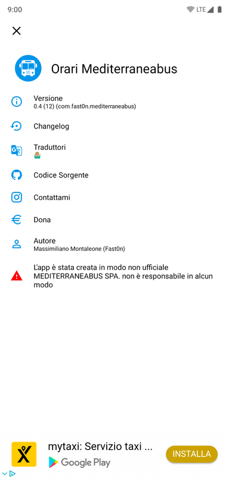
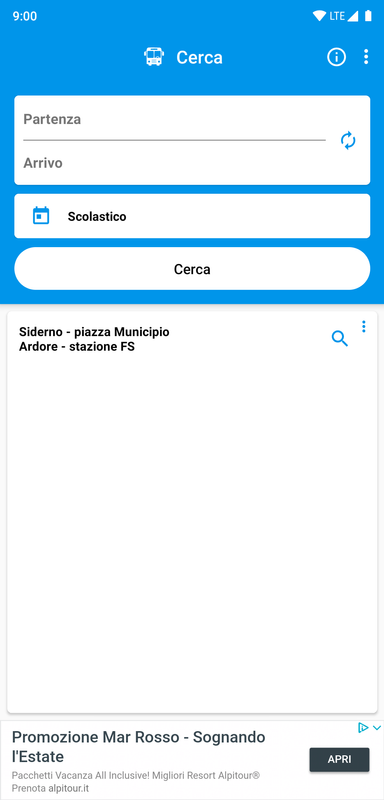
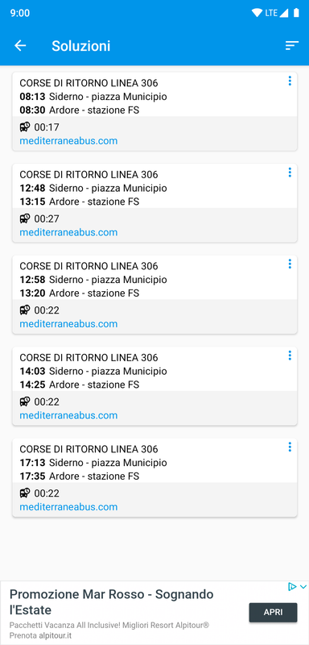

# Orari Mediterraneabus
App android per la visualizzazione degli orari della Mediterraneabus

   
 

## Download

  ⚠️L'app è stata creata in modo non ufficiale MEDITERRANEABUS SPA. non è responsabile in alcun modo⚠️

## Licenza
Con licenza GPLv3: http://www.gnu.org/licenses/gpl-3.0.html

## Screenshots

# Dona per il progetto
Per la creazione di questo progetto è stato investito del tempo, se ritieni che sia utile dona allo sviluppatore.

